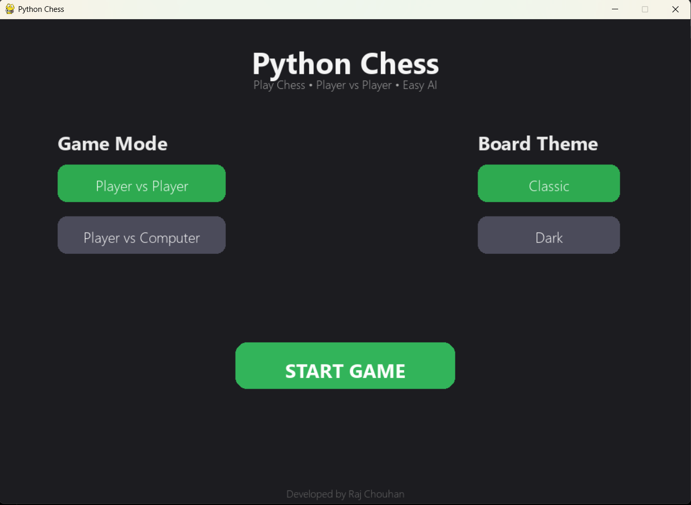
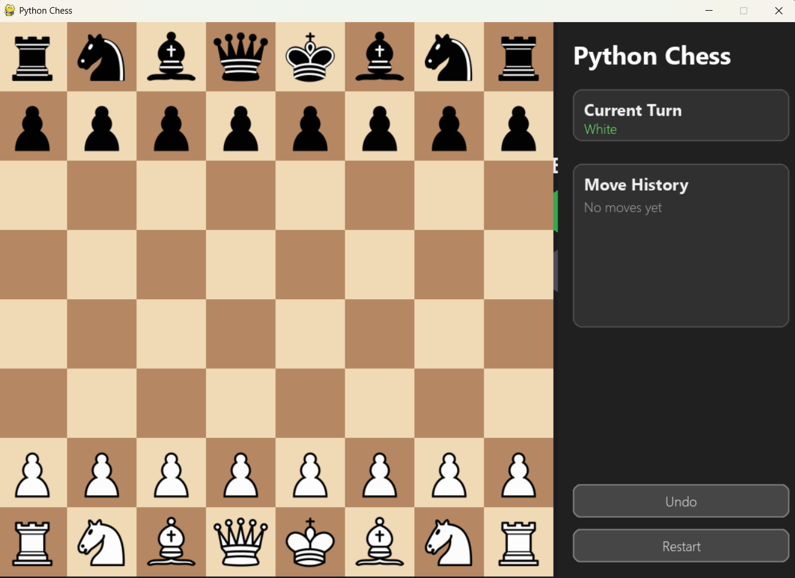
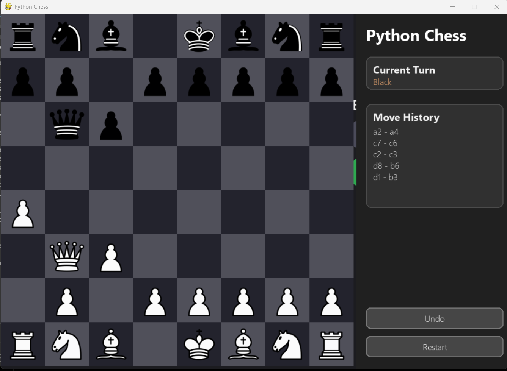

# ♟ Python Chess

A modern desktop chess game built using **Python** and **Pygame**.

## Features

- 🎮 Player vs Player Mode
- 🤖 Player vs Computer (Easy AI)
- 🎨 Classic & Dark Board Themes
- 📜 Move History Panel
- ♟ Complete Chess Piece Movement
- ⚔ Piece Capturing
- 🖥 Modern Desktop UI
- 🏠 Interactive Main Menu

## Tech Stack

- Python
- Pygame
- Object-Oriented Programming (OOP)

## Project Structure

```
src/
 ├── board.py
 ├── game.py
 ├── move.py
 ├── constants.py
 ├── pieces/
 └── ui/

assets/
 └── pieces/
```

## Run

```bash
pip install pygame
python main.py
```

## Screenshots

### 🏠 Main Menu



### ♟ Classic Theme



### 🌙 Dark Theme



---


## Future Improvements

- Check & Checkmate
- Castling
- Pawn Promotion
- Better AI (Minimax)
- Undo Move
